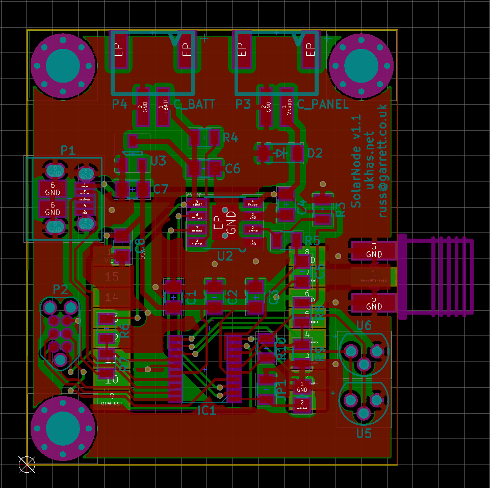

# UKHASnet SolarNode

A [ukhasnet node](https://ukhas.net) implementation designed for use as
a remote, solar/lithium battery-powered repeater.

## Features

* STM32 ARM micoprocessor
* CN3083 Li-Ion charge controller
* RFM89[H][W] radio
* Charging and configuration over USB
* Comprehensive battery telemetry:
    * Supply (solar panel) voltage
    * Battery voltage
    * Charge current
    * Charger status
* Breakout for one-wire sensors
